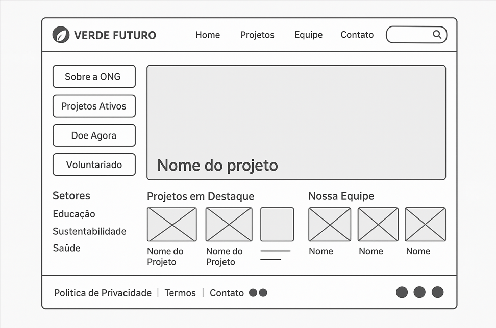
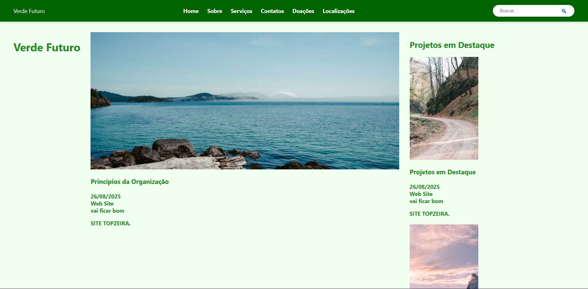
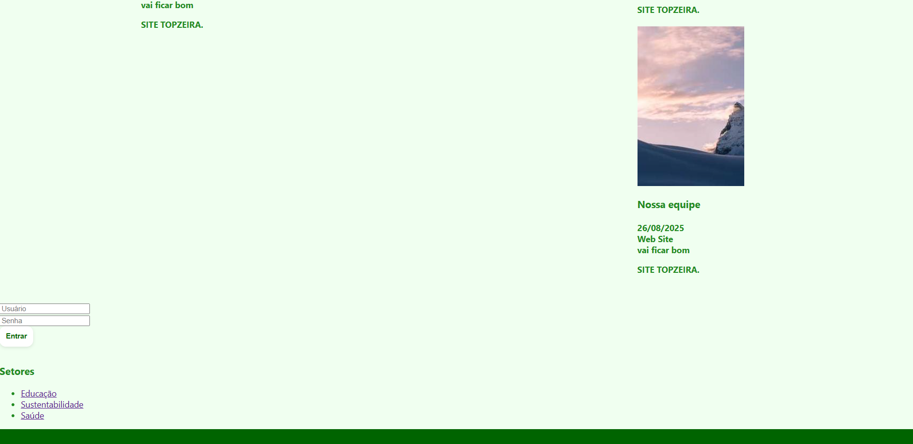

# Trabalho Prático - Semana 03

Dessa vez, vamos escolher uma proposta de projeto para trabalhar.

Nessa atividade, você deverá montar a página inicial do projeto escolhido, a organização do HTML aplicando semântica correta e uso aprimorado do CSS. Leia o enunciado completo no Canvas para mais detalhes.

**IMPORTANTE:** Você deve trabalhar e alterar apenas arquivos dentro da pasta **`public`**. Deixe todos os demais arquivos e pastas desse repositório inalterados. **PRESTE MUITA ATENÇÃO NISSO.**

## Informações Gerais

- Nome:Davi Quintanilha Fideles
- Matricula:898775
- Proposta de projeto escolhida: 3. Organizações e Equipes	
- Breve descrição sobre seu projeto: Criei uma ong chamada Verde futuro e aqui esta ua descrição de como eu imaginei o projeto dela: 
A Ong Verde Futuro tem como missão apoiar pessoas em situação de vulnerabilidade, oferecendo não apenas ajuda, mas também alimentação saudável e de qualidade para quem enfrenta a fome. Além disso, desenvolve projetos voltados à sustentabilidade, educação e saúde, sempre valorizando seus membros e voluntários. Escolhi esse tema porque considero muito relevante a realidade de pessoas vulneráveis, e acredito que dar visibilidade a essa causa é uma forma de reforçar a importância da solidariedade e da dignidade humana.

## Print do(s) wireframe(s) criado

<<  COLOQUE A IMAGEM AQUI >>

## Print da home-page criada

<<  COLOQUE A IMAGEM AQUI 
 >>
